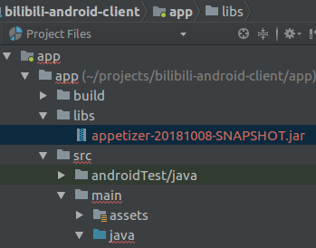

title: 使用Appetizer监控线上错误
---
# 使用Appetizer监控线上错误
在发行包中接入Appetizer服务，自动收集闪退、卡顿、HTTP错误等线上问题，可用于了解线上APP运行稳定情况或者监控灰度发版的质量。

**目前监控功能在内测中，暂时只支持以SDK方式接入Appetizer并开启监控，功能仅限监控Okhttp2/3的错误HTTP请求，未来将逐步将现有Appetizer数据收集功能剪裁后加入线上监控。以下为试用步骤（试用期间服务会快速迭代，请保持与Appetizer团队的联系）：**

## 接入步骤
* 下载最新版本的SDK jar文件，SDK更新快，以更新日期为版本标识，例如 `appetizer-20181008-SNAPSHOT.jar`，将jar文件放入 `app/libs/` 文件夹下，如下图：

* 在 `Application` 类的 `onCreate()` 中进行初始化
```Java
import io.appetizer.Appetizer; // 如果无法找到这个类，请检查jar是否就位，并刷新Gradle配置

class MyApplication extends Application {
    @Override
    void onCreate() {
        // 此处第二个参数是渠道名，请用英语字符串表示渠道，例如wandoujia, yingyongbao
        // BuildConfig.FLAVOR 是由Gradle 编译后自动产生的渠道名的变量
        // 如果渠道打包并非使用Gradle，可在代码中自行传入自定义渠道名
        Appetizer.init(this, BuildConfig.FLAVOR); // <--
        Appetizer.setLiveBetaId("xxx"); // 请设置测试用的id, 联系Appetizer团队获取
    }
}
```
  * 如果APP没有 `Application` 类，也可以在 `Activity`或者`Service`的`onCreate()`中初始化，越早越好

* 为Okhttp添加错误监控

如果okhttp3 版本>=3.11，能收集到错误信息（url, request headers），以及具体时间细分，如下：
```Java
import io.appetizer.live.NetworkMon;
import io.appetizer.live.Okhttp3EventListenerFactory;

NetworkMon mon = new NetworkMon(); // 生成监控配置
OkHttpClient client = new OkHttpClient.Builder()
    .eventListenerFactory(new Okhttp3EventListenerFactory(mon)) // <--
    .build();
```

如果okhttp3 版本<3.11，只能收集到错误信息（url, request headers），具体时间细分不可获取，如下：
```Java
import io.appetizer.live.NetworkMon;
import io.appetizer.live.Okhttp3Interceptor;

NetworkMon mon = new NetworkMon(); // 生成监控配置
OkHttpClient client = new OkHttp3Client.Builder()
    .addNetworkInterceptor(new Okhttp3Interceptor(mon)) // <-- 
    .build();
```

如果okhttp2 >=2.2，只能收集到错误信息（url, request headers），具体时间细分不可获取，如下：
```Java
import io.appetizer.live.NetworkMon;
import io.appetizer.live.Okhttp2Interceptor;

NetworkMon mon = new NetworkMon(); // 生成监控配置
OkHttpClient client = new OkHttpClient.Builder()
    .addNetworkInterceptor(new Okhttp2Interceptor(mon)) // <-- 
    .build();
```

如果okhttp2 <2.2 (Retrofit ≤ 1.8, Picasso ≤ 2.4) ，不支持，该升级了！

## 高级配置
### 过滤URL
传入的 `NetworkMon` 对象可以通过正则表达式过滤URL，实现不监控某些URL，或者只监控指定的URL
```Java
// NetworkMon(includes, excludes) 两个参数都是正则表达式，只会监控匹配includes并且不匹配excludes的URL
// 常用正则： .* 匹配所有字符串 .^ 不匹配任何字符串
NetworkMon mon = new NetworkMon(); // 生成默认监控配置，匹配所有URL
NetworkMon mon = new NetworkMon(".*", ".^"); // 生成监控配置，匹配所有URL
NetworkMon mon = new NetworkMon("^https:.*", ".^"); // 生成监控配置，匹配所有https请求URL
NetworkMon mon = new NetworkMon(".*", "^http:.^"); // 生成监控配置，不匹配所有http请求URL
```

### 错误捕获细节
* Appetizer 只捕获实际发生**网络传输**的HTTP请求，即如果一个请求被本地缓存，则该请求不会被捕获，因为监控的目的是捕获（实际发生的网络）错误
* Appetizer 捕获的请求可能是一个接口请求的中间请求，比如APP首先请求了一个URL A返回了301（Moved Permanently），然后okhttp会自动请求重定向的URL B，因为A和B都可能发生错误，错误监控会精细到请求链中的每一次请求，并且会区分A和B错误为两个错误
* 返回值为4xx和5xx的请求暂时不会捕获，此类错误已经达到服务端，一般在服务端的捕获会更有信息，未来可能考虑加入

## 调试
* 接入后，请按照正常方式打包APK（发布包），然后进行测试，建议至少在4.4-8.0设备上都进行全新安装启动，如果有回归测试/自动化Monkey等，请同样进行测试
* 启动后Logcat应该有以下信息（tag为`APPETIZER`全大写）
```
Appetizer has initialized  <-- Appetizer.init()后的效果
```
采集的错误数据在上传前会暂时存储在设备上 `/sdcard/Android/data/<包名>/files/io.appetizer/<包名>.log`
* 为测试错误监控是否能正常进行，可在APP启动后进行断网，然后使用会有网络请求的功能，并检查暂存文件是否有内容；如果没有内容，请联系 Appetizer 团队报告此情况进行进一步排查；如果有内容，请彻底关闭APP，然后再次启动APP，数据会即刻上传到服务端，通过最新版本的图形化界面查看
