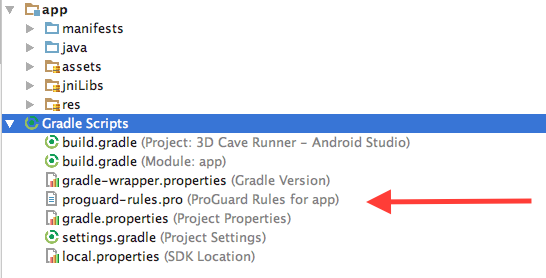
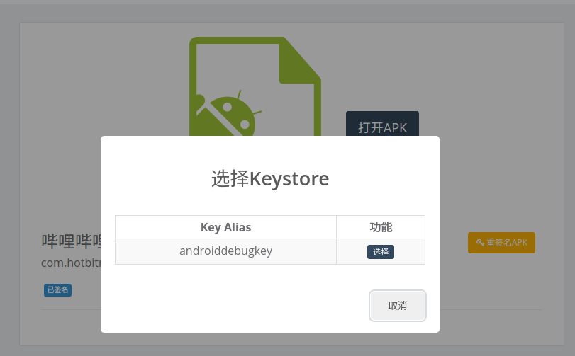
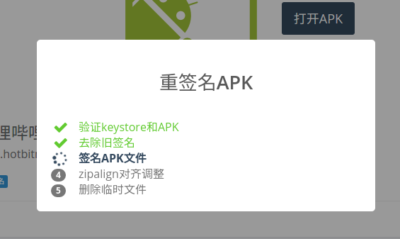

title: 混淆-加固-签名验证
---

# 混淆加固
插桩需要在dex里搜索相关的函数和函数引用。加固后dex内容不存在，而且加固防止二次代码修改，所以**加固包不可以插桩**；Appetizer设计为可以插桩混淆包，绝大多数功能，包括错误收集、性能数据收集，以及网络请求捕获都可以对混淆有效，唯一的例外是okhttp，请参考以下方案：

## okhttp和混淆
绝大多数的http库都不受到混淆的影响，唯一有问题的是okhttp，我们观测到强力的混淆会去除okhttp一些功能，导致Appetizer无法正常截获请求，**解决方案是到`proguard-rules.pro`里面，添加一下规则防止混淆okhttp**，首先找到这个规则文件：



然后添加
```
-keep class okhttp3.** { *; }
-keep interface okhttp3.** { *; }
-dontwarn okhttp3.**
-keep class com.squareup.okhttp.** { *; }
-keep interface com.squareup.okhttp.** { *; }
-dontwarn com.squareup.okhttp.**

-keep class okio.* { *; }
-keep interface okio.* { *; }
-dontwarn okio.**
```
这些字段保证混淆器不会删除okhttp的功能，Appetizer就能正常捕获okhttp的请求了。

## 签名检查与重签名
* apk插桩后需要重签名，默认Appetizer使用我们的debug key重新签名后提供下载，会存在以下潜在问题：
  * 如果设备上已经安装了未插桩的包，则在安装插桩包是会提示签名不匹配无法安装的情况，解决方法是1. 卸载设备上的APP后再安装 2. 或者直接使用开发的debug key重新签名插桩包
  * 如果APK本身有相关的运行签名检查，可能会造成闪退；解决方案是去除该检查，或者使用开发的debug key重新签名插桩包，可以打开主导航的APK文件工具对插桩后的APK进行重新签名


