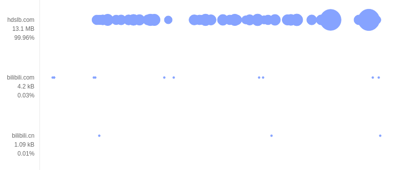

title: 网络流量优化
---
# 网络流量优化

套餐虽然优惠，流量还是很贵，对用户而言网络流量就是钱呐！用户习惯打开系统自带 APP 流量统计功能（如下），从 APP 的角度，总不希望用户一眼看出自家的 APP 是流量大户，所以有必要花时间知道 APP 的流量怎么流失的。但是系统的流量统计功能只是很粗略的对每个 APP 消耗的流量总量（分时）进行统计，但是程序员需要对 APP 的流量进行更精细、多维度的分析，从而有针对性地优化 APP 数据流量。

# Android 流量测量常用方法  

|  | 方法 | 局限 | 
| ---- | -------- | ---------- | 
| 从 linux 系统文件的流量 | Android 基于 Linux，系统提供了 `/proc/net/dev`、`/proc/uid_stat/{uid}` 等系统文件可获取整个系统以及具体 APP（uid） 的流量统计。[同类文章不计其数](https://testerhome.com/topics/2643)| 只能获取 APP 的某段时间的总流量，无法对流量进行更细粒度的分解，具体哪个请求耗流量   | 
| 从 Android API |  Android 本身也提供了一些 API 来获取系统流量（设置的流量统计就是从这里来的）：[TrafficStats](https://developer.android.com/reference/android/net/TrafficStats.html)   和 [NetworkStatsManager](https://developer.android.com/reference/android/app/usage/NetworkStatsManager.html)     |      本质也是通过读取系统中的流量数据文件，某些方法没有时间参数，没法获取具体时间段的流量，并且还可能要用户开启系统权限 /root 才能使用     |   
| 代理抓包 |  使用网络代理工具，截获每一个网络请求响应包，分析请求的数据量，常用的工具有：[tcpdump](https://github.com/the-tcpdump-group/tcpdump)、 [wireshark](http://blog.jobbole.com/70907/)，github 上提供了一个开源的数据包分析项目 [pcap2har](https://github.com/andrewf/pcap2har) |        很多抓包软件需要在设备上配置代理，做很多额外的系统配置，非常麻烦；代理对 https 支持不行，需要为每个域名安装伪造的证书；此外，抓包工具的流量分析并不现成，需要一定的二次开发        |    
  
注：鹅厂的 [GT](http://gt.qq.com/index.html) 性能测试工具的[流量测试方案](http://gt.qq.com/docs/a/faq/HowTestNet.pdf)其实就是以上三种方法的汇总，也就仅仅能获取某段时间内被测应用的 **流量大小和趋势** ，以及 GT 对 Wireshark 封装进行抓包，抓的是通过手机网卡的全部数据流量，却不能分析单独应用的流量情况。所以说鹅厂的 GT 工具对于手机应用流量只是停留在获得应用流量，拿下来看看的阶段，并不能提供行之有效的流量优化指导策略。

# 基于插桩的精细化分析
以上列举的几种流量分析方法，或是简单粗暴统计流量，开发者依然找不到耗费流量的程序代码；或是抓包，配置繁琐易错，二次开发成本高，实现自动化的代价高。理想情况下，开发者自行在源代码中打点，记录所有网络请求的起始结束以及流量消耗，然后分析 log，但是手工打点显然是要命的。
代码 **插桩** 从底层彻底解决了这些问题，根据规则对 APK 的字节码（ Dex 文件）进行修改，模仿人工，在 APP 每次发送的 HTTP 请求的地方插入监控代码，运行时采集请求数据，并分析流量。详细原理请看：https://testerhome.com/topics/9264

Appetizer 就是业界为数不多能够稳定应用插桩技术的工具，通过 **插桩监控 http 请求** 并进行精细化的正确性、性能、流量等多维度分析，支持基本所有的主流 http 库，事实上绝大多数的库都是对一些基本 http 库的再次封装（尤其是那些所谓的快速开发框架，基本都是用了 okhttp 来做 http 请求的）。所以 Appetizer 通过截获底层的这些库来支持包括 HttpURLConnection， Apache HTTP client, okhttp 2/3，retrofit, volley 等。同时 https 是完全可以截获的，不同于抓包工具，抓包工具的底层原理是网络代理，而 https 的设计是防止代理软件看到请求内容，所以抓包工具需要额外配置伪造的证书等等麻烦的事情；而 Appetizer 的底层原理是 **打点** ，采集的数据好比在源代码里面能看到的数据一样，没有这个问题，https 请求的内容可以完美抓到。  
  
使用 Appetizer 进行插桩分析的方法很简单，上传 apk，插桩，下载插桩后的 apk，然后在设备上跑，完成后通过 Appetizer 分析，生成测试报告。具体例子，请戳 [https://testerhome.com/topics/8162](https://testerhome.com/topics/8162)。  
每次分析会产生一个分析报告，请戳眼睛打开报告：

这是一个 Appetizer 测试报告的截图，这里看到的是统计信息，左边四个功能项目分别是：统计信息，业务流程建模，详细时间轴图，流量分析；所以请戳第四个

点击进入流量分析界面，横轴是时间，纵向是分类标准，一个点代表一个 http 请求，大的代表流量大，支持左右拖拽以及滑轮缩放，上方有六种分类标准辅助流量分析

  
点击图中某个点，可以查看对应网络请求的详细信息  

# 寻找流量杀手并优化
既然是对流量进行分析，很自然的，我们需要知道 APP 进行网络请求的域名、以哪种方式发送与接收数据、数据类型等。Appetizer 提供的精细化流量分析从不同的维度解析 APP 网络流量，从不同角度建议优化策略。

## 按类型分类: 图片处理？ HTTP 压缩？

Appetizer 将网络请求，按照获取数据类型划分为图片、文本、协议和其他请求，实际 APP 使用最广泛的三类。以上图为例，总体来说，APP 网络请求以协议流量和图片流量为主，协议流量多而密集，图片流量少而大，自然优先优化协议请求和图片。

**协议** 通常是请求某个业务数据，返回数据类型常见为 JSON, XML 等文本格式，最有效的方法就是 [gzip 压缩 http 请求](https://zhuanlan.zhihu.com/p/24764131)了，压缩率一般高达70%以上。安利一个[检测是否启用 gzip ](http://tool.chinaz.com/Gzips/)的工具，以 testerhome 首页为例，压缩率达到了80%。

 **图片资源** 也是现代 APP 主要的"流量大户"，因为 APP 普遍都要适应高清化的体验，产品的图片越来越大。其实图片格式上也非常有讲究，选择更高效的图片处理框架，可以自动对网络的图片进行自动转码、适应屏幕、自动缓存等，节省流量的同时节省内存提高图片加载效率。常用的有：[Picasso](https://github.com/square/picasso)、[Glide](https://github.com/bumptech/glide)、[Fresco](https://github.com/facebook/fresco)。此外，很多 APP 有一个设置是在WIFI和流量下使用不同清晰度（大小）的图片，这也是可以考虑的一个设计。

最后 **文本（网页）** 顺应 h5 化的浪潮也慢慢成为流量大军中值得关注的部分，类似协议，文本类的数据用 gzip 压缩，又快压缩率又高。

## 按`MIME`类型分类: 使用现代的格式和库

[MIME](https://developer.mozilla.org/en-US/docs/Web/HTTP/Basics_of_HTTP/MIME_types)类型是 HTTP 响应的 `Content-Type` 域，对请求数据类型进行更细粒度的划分，常见有以 `text`、`image`、`application` 开头的格式类型。对于图片流量，不同类型图片在 
Android 中的显示代价是不同的，使用不同显示方式代价也是不同的。比如，png 图片占的内存较大，若 png 图片过多，会容易垃圾回收，甚至内存溢出；而 jpg 图片的内存小，但是图片解码复杂，耗时多。开发者根据上图中图片的类型选择最优的图片[优化方式](https://juejin.im/post/58faf2c0570c350058d46553)。此外，可以建议运营使用更现代格式（解码快，文件小，质量高），比如使用 webp，使用 [mozjpeg 库提高 jpeg 图片20%的压缩率](https://github.com/mozilla/mozjpeg)，使用原生 mpeg4 格式替代 gif 等。

## 按根域名/子域名分类: 明明白白第三方 SDK 流量

在 APP 开发中需要用到很多第三方提供的 SDK 服务，例如地图服务，广告等等。Appetizer 从请求`url`中提取出服务器域名，获取 APP 网络请求数据的来源。从根域名分析结果图中，首先能够获取 APP 发出网络请求的所有服务器（自家域名，三方域名）情况，有针对性的关注请求最多的服务器，能监控到不同时间段服务器的响应情况。

## 按请求方法分类：关注到流量的协议设计
APP 客户端发送 HTTP 请求，最常用的[请求方法](https://developer.mozilla.org/en-US/docs/Web/HTTP/Methods)有 GET（下行流量）、POST（上行流量）。请求方法结果图，反馈给开发者 APP 每个网络请求的数据请求方式是什么。从图中的分布，可以排查出因请求方式差异造成的流量问题。例如常见的 POST 重复加载问题：当我们多次发出同样的 POST 请求后，其结果是创建出了若干的资源，造成了流量的无效消耗，诸如此类问题都能通过请求方法分类的图中查到；而 GET 请求，从定义上应该要指定返回内容的缓存可能行，现代的 HTTP 例如 okhttp 都可以识别缓存要求，并自动进行本地文件缓存，减少不必要的重复请求。

## 按网络库分类: 统一使用高效的 HTTP 库
APP 中常用的 [HTTP 请求库](http://blog.csdn.net/sbsujjbcy/article/details/45568053)有 HttpURLConnection, Apache HTTP Client, OkHttp，不同的请求库产生的数据流量也是不同的。HttpURLConnection 具有的压缩和缓存机制可以有效地减少网络访问的流量，OkHttp 自动添加`Accept-Encoding: gzip`，支持自动解压，并对 HTTP 响应的内容在磁盘上进行缓存。根据结果图中不同网络请求使用的网络库情况，在优化 APP 时选择最优的 HTTP 请求库。