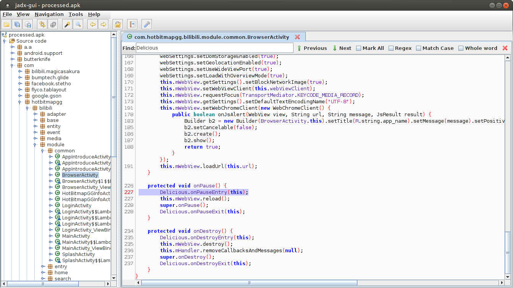
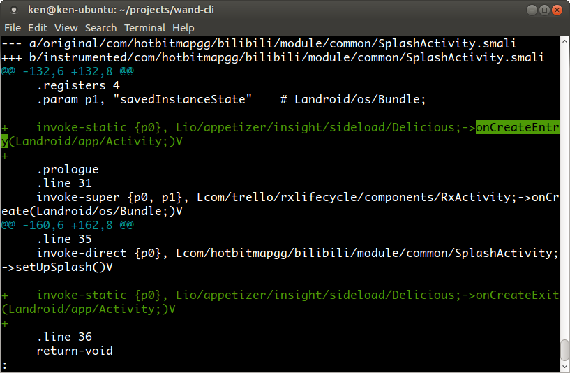

title: 插桩原理
---
# 插桩原理
插桩，就是基于一定规则自动地进行代码打点，例如如果程序有这样的网络请求代码：
```java
    URL url = new URL("http://www.example.com/comment");

    HttpURLConnection connection = (HttpURLConnection) url
            .openConnection();
    connection.setDoOutput(true);
    connection.setRequestMethod("POST");

    OutputStreamWriter writer = new OutputStreamWriter(
            connection.getOutputStream());
```
Appetizer 通过在代码里面查找 `openConnection()` 这个函数调用，在后面插入代码收集请求数据，如：
```java
    HttpURLConnection connection = (HttpURLConnection) url
            .openConnection();
    Appetizer.collect(connection); // 把这个请求的信息保存下来
```

## 会搜集什么数据
Appetizer log的信息包括：url，请求参数（http request header），返回头（response header）；不log 请求体(request body)和返回体（response body)；简单来说，只是请求的参数信息，不包括具体传递的POST数据和返回内容，**所以安全上，Appetizer不搜集 APK的敏感请求数据**

那大家在apk中可能会用不同的http库，比如常用的okhttp等等，Appetizer的做法是对于每一个http都有相应的规则去搜集数据。虽然开发中可能会用到很多不同的http库，事实上绝大多数的库都是对一些基本库的再次封装（尤其是那些所谓的快速开发框架，基本都是用了okhttp来做http请求的）。所以Appetizer通过截获底层的这些库来支持包括HttpURLConnection， Apache HTTP client, okhttp 2/3，retrofit, volley等。

## http/https
**https是完全可以截获的**，不同于一些抓包工具，抓包工具的原理是代理，而https的设计是通过验证证书来防止中间人攻击(man-in-the-middle attack)的，而代理软件就是一种中间人，所以抓包工具需要额外配置伪造的证书等等麻烦的事情；而 **Appetizer完全是打点，采集的数据好比在源代码里面能看到的数据一样，没有这个问题，https请求的内容可以完全抓到**

## 不支持的HTTP库
* okhttp <2.2, retrofit <1.8 （2.2是2014年的东西）
* apk被强力混淆后okhttp的内容被去除的情况，只需要配置Proguard-rules.pro避免混淆okhttp的相关包即可，详细请参考[混淆-加固文档里的解决方案](obfuscation.html)

## 权限问题
* Appetizer不会主动调用需要特殊权限的Android API收集数据；也就是当APP拥有必要的权限通过Android API获取数据时，Appetizer被动收集需要的数据；因此并不需要特殊的权限配置
* 然而，log需要输出到sdcard保证桌面客户端能够获取，也就是需要 `WRITE_EXTERNAL_STORAGE`，所以
  * APP需要在AndroidManifest声明需要`WRITE_EXTERNAL_STORAGE`以及`READ_EXTERNAL_STORAGE`权限，否则上传后会拒绝插桩
  * 在Android 5.0+，在APP启动前，需要获取这些权限（granted）；通过桌面客户端安装授权可以自动授权，手工安装或者直接通过adb请运行 `adb pm permission` 相关命令
  * 我们正在研究规避这个权限问题的方案

## log存储位置
* 正常情况下，插桩包有 `WRITE_EXTERNAL_STORAGE` 权限，运行后会将log记录在 `/sdcard/io.appetizer/<包名>.log`
* 插桩包启动后不产生该文件，通常为权限问题
* 此文件在插桩包的运行过程中会随时会被修改，所以不能同时修改！在彻底关闭APP的安全情况下可以操作，注意，APP需要彻底关闭（不能有后台进程）

## 65k问题和multidex
* 65k问题指的是当代码量增大后，由于Google早年设计缺陷，一个DEX文件只能容纳 65536个方法、方法引用等，解决方案通常是使用Google提供的multidex库
* 当下，很多APP都已经碰到并解决65k问题，插桩本身不可避免会引入新的方法以及方法引用，Appetizer支持multidex，插桩策略如下：
  * 插入的代码（大量新函数引用）会被尽量合并到classesN.dex而不是primary dex (classes.dex)，有必要时会产生classesN+1.dex
  * 尽量减少修改现有dex文件引入的新方法引用
* 尽管如此，仍有极端情况会导致插桩失败
  * APP原本没有multidex，并且已近迫近65k，插桩后超额；解决方法：引入[multidex](https://developer.android.com/studio/build/multidex.html)即可，Appetizer会自行分包
  * APP的某个dex文件非常迫近65k，插桩后无法增加任何打点；目前Appetizer会跳过该dex，导致收集不到该dex的类的数据，但整体插桩任务可以完成；解决方案：通过编译时增加 [`--set-max-idx-number`](https://stackoverflow.com/questions/27631500/is-there-a-way-to-limit-method-amount-in-main-dex-file-while-using-multidex-feat/27766126)迫使编译器尽量不要塞满dex

## 插桩会与其他数据收集SDK冲突么
* Appetizer 秉承公平竞争的原则，在检测到有类似功能的 SDK 需要收集类似功能时（例如通过 Okhttp interceptor 或者 uncaughtExceptionHandler）会传递相关信息，保证兼容

## 插桩后APK包会增大多少
* Appetizer 增加的部分是插入的DEX代码，约为170KB；另外重新签名和重新打包过程中会减小APK的大小，两项总和的情况下APK大小可能反减不增。另外在multidex的情况下，Appetizer增加的DEX可能会安排在次classes.dex里，不会增加APP创建进程的时间（冷启动时间）

## 安全性
Jadx反编译             |  Smali diff
:-------------------------:|:-------------------------:
  |  
* Appetizer所有打点都是透明的，可以通过 [jadx](https://github.com/skylot/jadx) 之类的反编译工具进行查看
* 打点收集的数据，都是APP已经获取的，也就是Appetizer只是被动获取；另外为隐私考虑，Appetizer只获取HTTP Request/response header，不获取body
* 有数据合规性考虑的公司，可以考虑 [私有化部署](private-deployment.html)

## 手游/H5/debug/release
* 手游支持吗？
  * 部分支持，注入只处理Java层的问题，框架托管的代码，比如 Unity 的 C# 没有插桩； Lua 代码也没有插桩
* 支持混合APP吗？
  * 支持 ReactNative ,  Weex 开发的 APP ，虽然H5代码不会插桩，但是很多请求依旧从 Java 层触发的操作（例如网络），Appetizer 都能正常捕获
  * Cordova支持有限， WebView 内的功能正在研发中
* 支持 debug 包,  release 包，混淆么？
  * 两者都支持，支持绝大多数混淆，详细请见 [混淆与加固](obfuscation.html)

## 可以插桩发布包么
* 理论上是可以的，但是考虑到用户目前不会回传log到服务器
* 发布包插桩以及生产监控正在内测中，敬请期待
