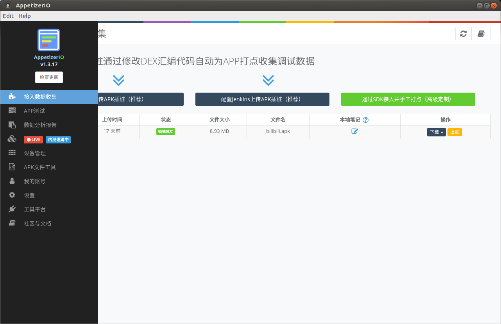
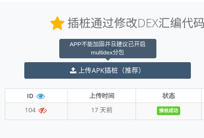
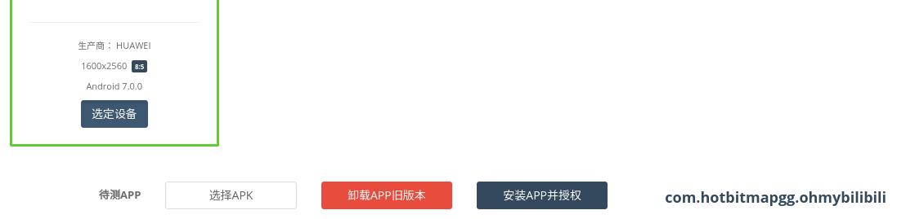

title: 快速入门
---
# 快速入门

> 什么样的工程师没药救？ 只会用百度 翻墙也不舍得翻 页内ctrl+f 也不会 就会干用眼睛看 搜索seo 关键词 也不会 好的站内搜索工具也都不用 就是干用百度查 — testerhome [小马 @harsayer](https://testerhome.com/harsayer)

## 安装
* 安装JDK, Android Studio, Android SDK 可以参考 [教程](https://blog.csdn.net/hebbely/article/details/78970918)
* 到Appetizer 主页 https://appetizer.io/cn/  注册 AppetizerIO 账号，并下载最新版本的客户端（解压）；Appetizer支持Windows, Linux, MacOS
* 运行Appetizer/Appetizer.exe/Appetizer.app，如果有防火墙相关问题，请配置防火墙不阻挡Appetizer
* 登录后，界面如下：

* 如果登录后弹出需要ADB，请检查Android SDK 的platform-tools是否正确安装并且是否添加到了PATH，默认adb位置在：
```
# MacOS
~/Library/Android/sdk/platform-tools
# Windows
C:\Users\Administrator\AppData\Local\Android\sdk\platform-tools
# Linux
~/Android/Sdk/platform-tools
```

## 插桩
* 在图形化界面的左边主导航选择 `插桩APK` ，点击上传APK

* 选择APK文件，等待插桩完成，选择 `刷新列表`，列表最上方的插桩任务可以 下载插桩后的APK（插桩包）或者上报插桩问题（吐槽）

* 注意：APK必须有 `WRITE_EXTERNAL_STORAGE` 和 `READ_EXTERNAL_STORAGE` 权限，不可加固，可以混淆；如果不符合，会弹框告知，并且插桩任务的状态会相应显示，例如

* 如果是服务器相关问题或者长时间显示为等待上传，请上报

## 运行测试并提交分析
* 通过USB连接测试Android设备，在设备上启动开发者选项->USB调试，在主导航选择 `APP测试`，显示检测到已连接的设备；选择设备，选择已插桩的APK，应该如下图所示

* 点击 `安装APP并授权` 后，点击 `启动APP并开始测试`
* 在设备上对APP进行操作，然后点击 `上传分析` 等待分析完成

* 完成测试用于放弃这次测试的数据，之后可以重新开始

## 查看报告
* 完成测试以及上传分析步骤后，在主导航选择 `分析报告`，点击眼睛图标打开该报告；

* 可以点击 `打开样例报告` 查看一次比较完整的手工测试后产生的报告
* 报告中会记录测试过程中遇到的问题，包括异常和ANR（闪退问题），性能问题，以及网络的相关问题


## 继续阅读
* [使用录制重放工具简化重复劳动](replay.html)
* [选择合理的测试方法 提高测试覆盖面 让Appetizer找到更多问题](testing.html)
* [理解Appetizer报告找到的问题 导出报告进一步分析](analysis.html)
* [接入更多的第三方服务 从报告开始构建完整质量保障体系](3rdparty.html)
* [去社区逛逛 看看大家的踩坑记和经验](https://testerhome.com/topics/node127)
* [加入QQ群 467889502 和Appetizer团队以及大家互动](http://shang.qq.com/wpa/qunwpa?idkey=4f1ef873aac8ca2a545fae99067ef5f4e505ac4a6ee3d1fad937a5dfe43ae274)