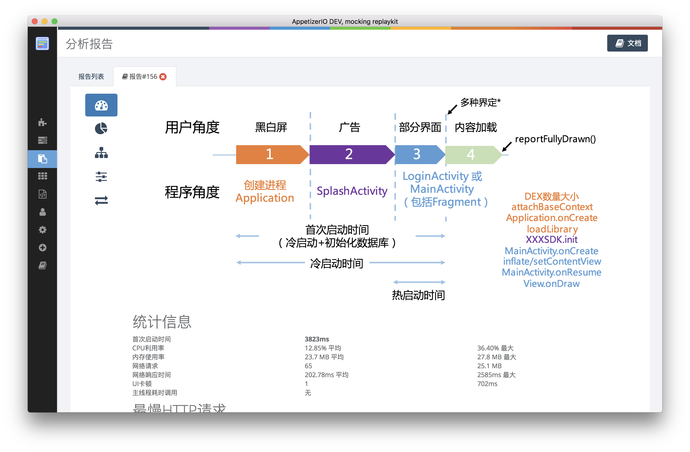

title: Appetizer
---

# Appetizer 移动开发智能化平台
Appetizer 是一个全面的移动测试以及数据分析平台，数据采集功能在APP运行中收集错误、性能、网络信息，用于调试、诊断错误、评估性能；集成的各种测试工具能够[高效编写UI自动化脚本]()、[执行UI压力测试]()、[自动化Monkey/遍历界面与功能]()、[一键测量APP冷热首次启动过程]()等。 Appetizer是完整的开发生态，开发接入优质第三方工具，从开发到发版形成统一的闭环。通过[5分钟快速入门教程](get-started.html)开始改革移动开发工具吧!

## 数据收集报告专业
<video src="/videos/report.mp4" autoplay loop controls muted width="50%" class="center-block"/>
| 网络请求详细细节 | 时间轴图运行过程明明白白 | 流量优化异常简单 | 
|:-----------------:| :---------------: | :--: |
|   || |

## 高级测试工具提高效率、自动化
|  从APP的浮动框方便进行手工测试  | 精确测量APP启动过程 | 配置UI压力测试 | 
|:-----------------:| :---------------: | :--: |
|   || |

## 常用工具一键部署启停
|  常用工具一键部署启停  | STF多设备管理 | Hitchhiker接口压力测试 | 
|:-----------------:| :---------------: | :--: |
|   || |



 This work is licensed under a <a rel="license" href="http://creativecommons.org/licenses/by-nc-sa/4.0/">Creative Commons Attribution-NonCommercial-ShareAlike 4.0 International License</a>.


