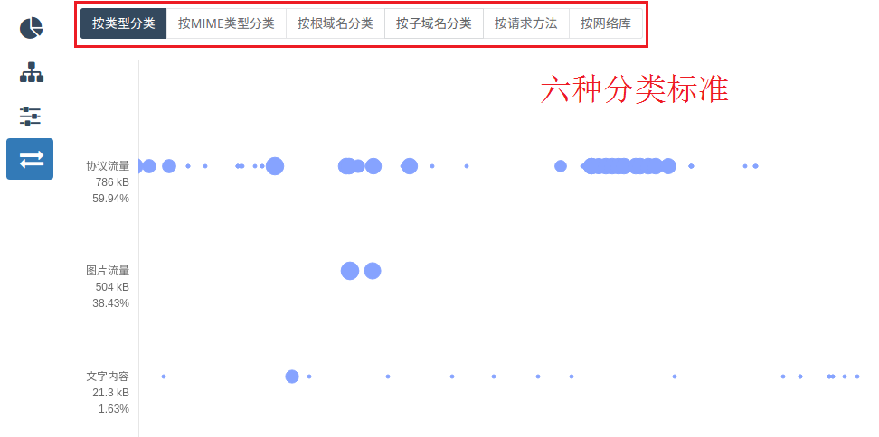
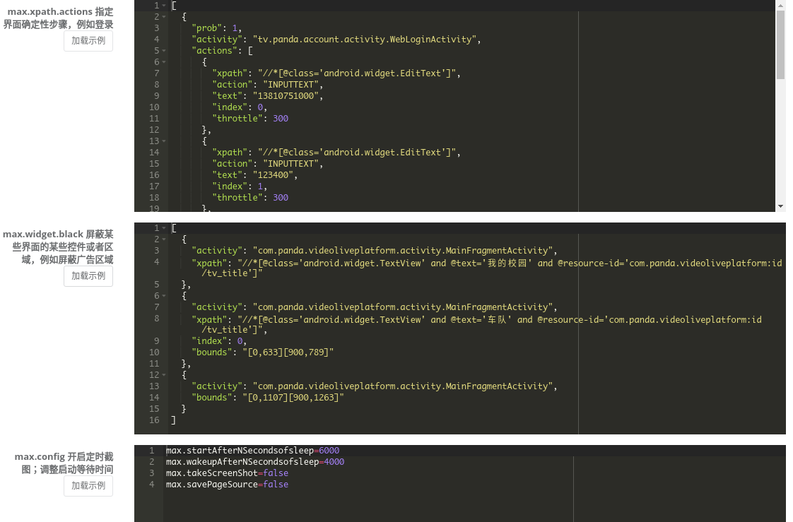

title: Appetizer
---

# Appetizer 移动开发智能化平台
Appetizer 是一个完整的移动开发、测试以及分析平台，自主研发的插桩技术可以为APK自动增加各项监控功能，收集错误、性能、网络信息，用于调试、分析。 Appetizer是完整的开发生态，开发接入优质第三方工具，从开发到发版形成统一的闭环。通过[5分钟快速入门教程](get-started.html)开始改革移动开发工具吧!

## 插桩得到专业的报告
| 细节指到问题代码那一行 | 时间轴图明明白白 | 流量优化异常简单 | 
|:-----------------:| :---------------: | :--: |
|   || |

## 多种测试工具支持
|  从APP的浮动框方便进行手工测试  | 多种专业配置 | Maxim开始UI压力测试 | 
|:-----------------:| :---------------: | :--: |
|   || |

## 集成第三方工具
|  多种服务安装方便  | STF多设备管理 | Hitchhiker接口压力测试 | 
|:-----------------:| :---------------: | :--: |
|   || |



 This work is licensed under a <a rel="license" href="http://creativecommons.org/licenses/by-nc-sa/4.0/">Creative Commons Attribution-NonCommercial-ShareAlike 4.0 International License</a>.


