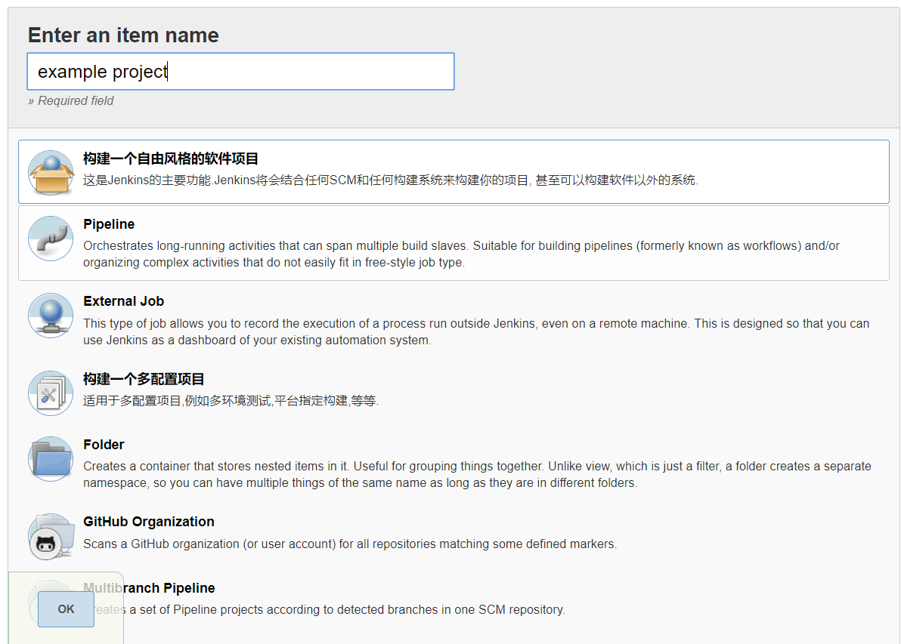
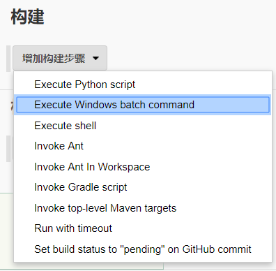
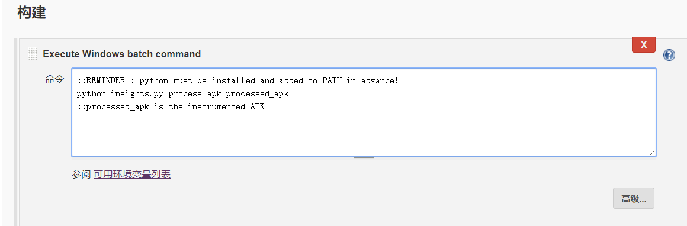
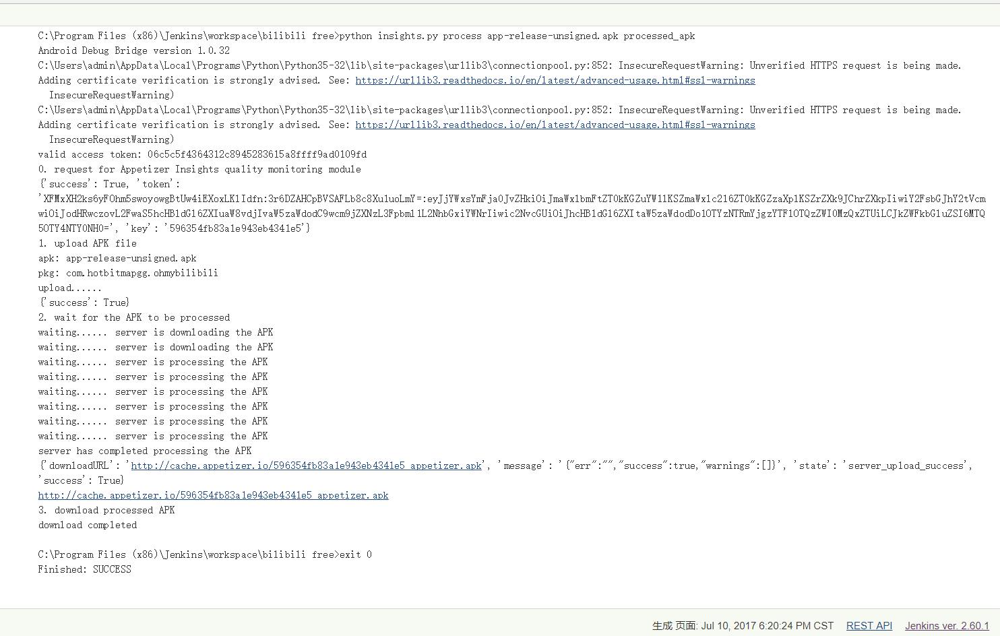

title: 插桩分析 Jenkins接入
---
# 插桩分析 Jenkins接入

Jenkins是企业持续化集成的标配，本文介绍如何在单机Jenkins, Master-slave Jenkins, Jenkins Pipeline以及Jenkins REST API接入Appetizer质量监控服务。

## 前置配置
* 配置Jenkins（搜一下TesterHome太多了）
  * https://testerhome.com/topics/4349
  * https://testerhome.com/topics/2464
  * https://testerhome.com/topics/8352
  * https://jenkins.io/doc/
* 安装Python环境（python 2.7.x或者3.3+），确保Python在PATH里，Jenkins可以执行python命令
  * 同样搜一下Testerhome
* clone insights.py项目，https://github.com/appetizerio/insights.py
  * clone后按照要求配置，　`pip install -r requirements.txt`
  * insights.py项目需要安装了nodejs；另外，安装apk功能和分析功能需要有Android SDK (adb)
  * `python insights.py login <username> <password>` 登录Appetizer账号，token会存在insights.py同目录，60天有效，期间使用appetizer服务会自动续期60天

## 单机版Jenkins配置
* 比如你的个人项目是一个Jenkins 自由风格软件项目


* Git然后 `gradle` 编译的，在编译步骤增加如下命令，Windows的用　`Execute Windows batch command`，　Linux和MacOS上用 `Execute Shell`
  * 注意，insights.py请自行替换成之前配置的insights.py工程路径（比如 `/Users/haha/insights.py/insights.py`，注意一个是目录名，里面的才是实际Python脚本文件）
  * 命令的参数中apk是gradle编译的apk文件的路径，和具体Jenkins配置的working directory有关，一般是`build/outputs/apk/app-debug.apk`
  * 命令的参数中processed_apk是存放插桩后的apk文件的路径，同样，一般是 `build/outputs/apk/app-debug-appetizer.apk`


* 全部配置完成后尝试构建，输出大致应该是这样的


## Jenkins Pipeline配置
从2.0版本起，Jenkins开始支持pipeline功能。简而言之，Jenkins pipeline提供了通过配置文件定制整个集成流程的功能，无论编译、测试、部署、生成报告都可以通过一份文件完成配置。相比于传统的交互式配置，Jenkins pipeline有着可移植性和易用性上的绝对优势，因而在工程实践中应用广泛。

这是一个用Jenkins pipeline集成insights.py的配置文件模板样例，大家可以根据项目的实际情况做适当的修改。

```
pipeline {
agent any /*replace 'any' with the agent to use*/

stages {
    stage('Build') { 
        steps { 
            //build command here
        }
    }
    stage('Test'){
        steps {
            //Test command here
        }
    }
    stage('Deploy') {
        steps {
            //Deploy command here
        }
    }
}
post{
        always{
            // 这边同样，命令行参数要求见单机配置
            bat 'python insights.py process apk processed apk'
        }
    }
}
```
* Pipeline的相关教程
  * https://jenkins.io/doc/pipeline/tour/hello-world/
  * [Jekins 2.7 pipeline 功能使用介绍](https://testerhome.com/topics/5044)
  * [Jenkins pipeline的10个最佳实践](http://www.ciandcd.com/?p=164)
  * [Jenkins 2 pipeline实例](http://www.ciandcd.com/?p=155)

## Master-slave Jenkins配置
* 前置要求都是配置在slave上的
* 按照单机配置的要求配置Jenkins slave机器
* 如果有需要在多个Slave间传递文件，可以看一下 http://blog.csdn.net/itfootball/article/details/45059365

## Jenkins REST API
* 既然已经到高级玩家用REST API，那么很简单，insights.py只需要在gradle完成正常的构建后对apk进行插桩即可
