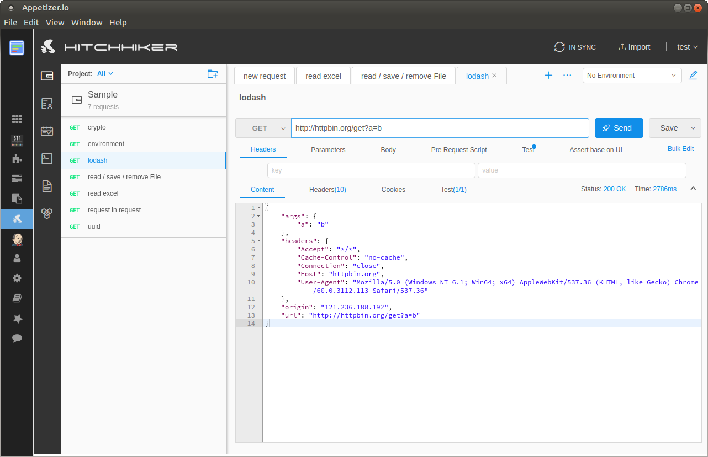

title: 接入第三方服务
---

# 接入第三方服务
在主界面左边主导航中点击添加新的第三方服务，新添加的第三方服务会出现在主导航上，并可以删除。

### 自动检测本地服务
管理见面右上角的功能按钮，点击 自动检测本地服务，会按照第三方服务的默认本地部署网址进行检测，被检测到的服务会自动添加到主导航

### 提交新的三方服务
可以建议集成新的第三方服务，务必提供github地址，部署指南，以及为什么要集成该服务；一般成熟的服务，部署简单的，功能优良的会优先考虑

## 设备控制 STF

## 接口测试 Hitchhiker

