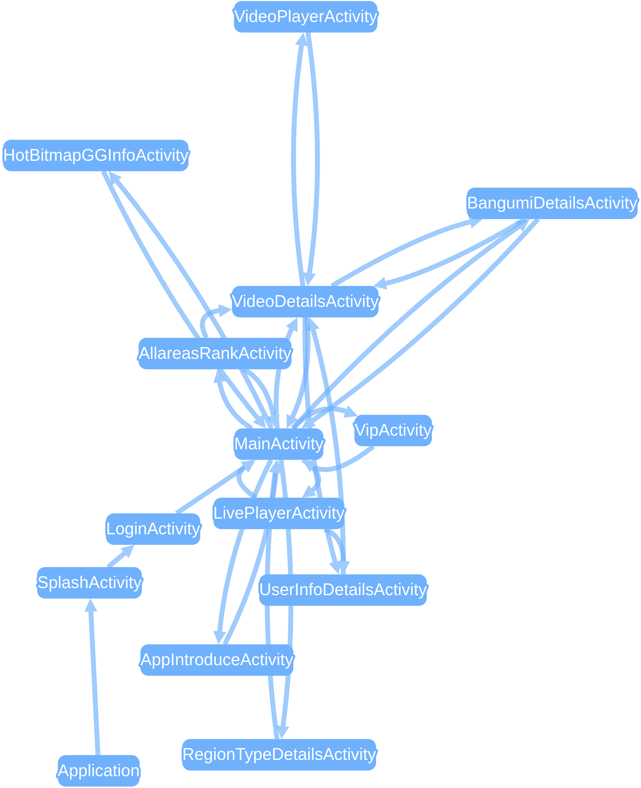

title: 分析
---

# 分析
测试完成后（上传分析成功后），Appetizer会根据运行过程中收集的日志数据（log）产生报告，报告中会记录所有的异常、ANR、性能问题以及网络问题。在主导航选择分析报告进入分析界面，从列表中可以选择打开报告。如果没有报告也可以查看样例报告；样例报告是[开源bilibili客户端](https://github.com/HotBitmapGG/bilibili-android-client) 的一次手工测试，覆盖大部分功能。

## 理解报告
报告上半部分分别有 报告摘要、APP执行的页面切换图、APP执行时间轴图 以及流量分析。下方为报告捕获的问题，以及问题列表，点击某个问题进入**详细信息**。关于报告中问题诊断的详细阈值请参考 [分析原理](../advanced/under-the-hood-analysis.html)

### 报告摘要
报告摘要展示了此次测试的主要统计信息

### 页面切换图
页面切换图每个节点是一个Activity，边为跳转关系，用于查看测试的界面覆盖情况以及页面间的关系，数据可以以多种格式导出。

### 时间轴图
时间轴图上X轴为时间，Y轴为APP内发生的不同事件，每个点为一个时间，黄色点为诊断有问题的事件（例如网络延迟高），红色点为有错误的事件（例如异常或者网络错误）；可通过鼠标缩放左右拖拽，每个点点击下方会出现具体细节，可以高亮错误或者降低效果（为有大量数据的报告）；时间轴图主要用于精细化诊断问题

### 流量分析
流量分析列举了所有网络请求消耗的流量，图中X轴为时间，Y轴为网络请求的分类，每个点为一个网络请求，可以点击（下方会显示该请求的详细信息），点大小代表流量消耗的大小，有六中分类标准。按照类型分类可以诊断APP主要的流量是用于请求协议还是静态资源（图片，网页等）；按照MIME类型分类可以更细粒度分析；按照根域名/子域名分类可以诊断流量是哪个服务器或者是第三方SDK消耗的；请求方法为POST/GET等分类；详细流量分析及优化方法请参考[教程](../advanced/traffic.html)

## 报告导出
报告可以导出成多种通用格式用于进一步分析，

* JSON，格式详见 [分析原理](../advanced/under-the-hood-analysis.html)
* HTML 可读网页形式
* csv格式导出为一个包含多个csv文件的zip文件，每个csv文件记录了一个方面的问题，可以直接用 Excel/OpenOffice 打开
* HAR是通用的抓包数据格式，详细可参考 [介绍](https://testerhome.com/topics/10841/)，可以被Insomnia,Chrome,HTTPRunner等导入，例如

* cURL是将所有的网络请求以cURL命令行的方式导出，每个请求一行，每行cURL命令可以直接在命令行执行，或者被Postman，Insomnia等接口测试工具导入，例如

* **正在开发中** swagger定义文件

## 常见问题
* 报告没有内容 -> 检查运行的是否为插桩包