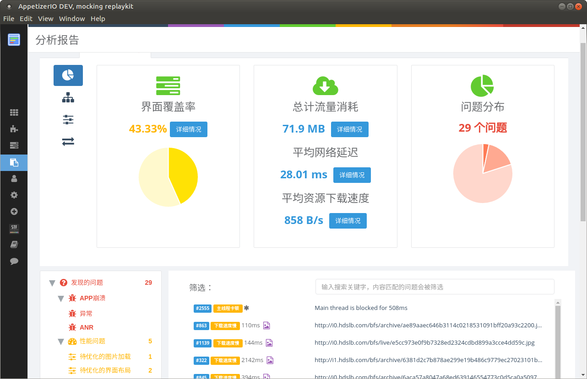
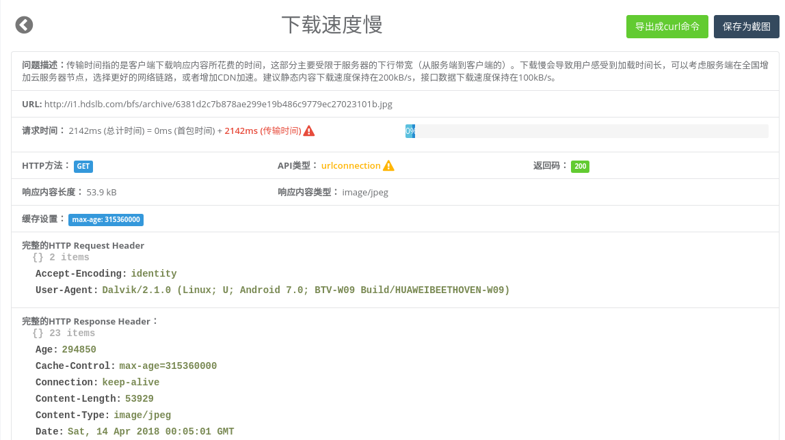
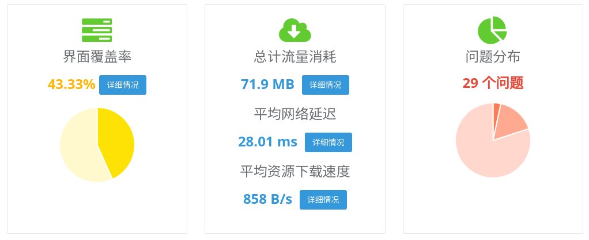
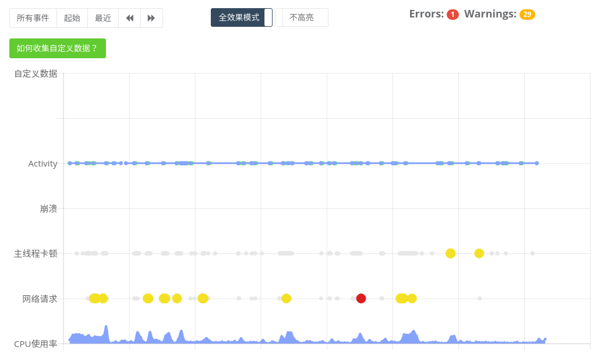
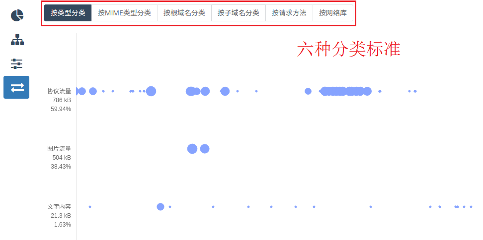
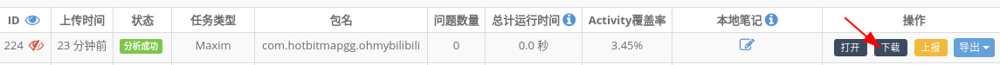
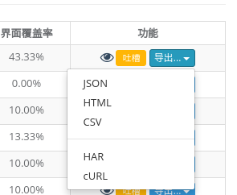
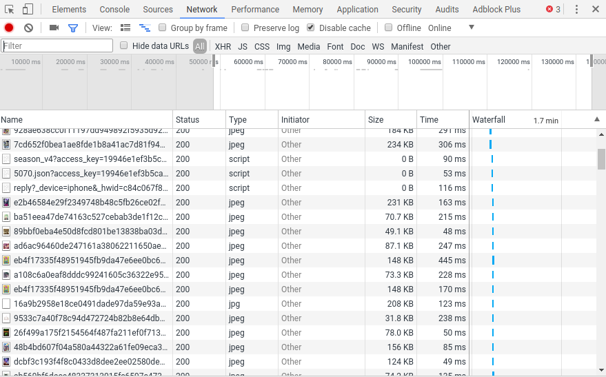
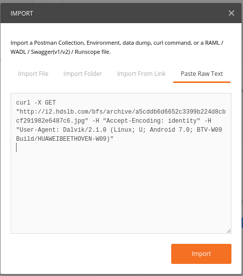

title: 分析
---

# 分析
测试完成后（上传分析成功后），Appetizer会根据运行过程中收集的日志数据（log）产生报告，报告中会记录所有的异常、ANR、性能问题以及网络问题。在主导航选择分析报告进入分析界面，从列表中可以选择打开报告。如果没有报告也可以查看样例报告；样例报告是[开源bilibili客户端](https://github.com/HotBitmapGG/bilibili-android-client) 的一次手工测试，覆盖大部分功能。

## 理解报告
报告上半部分分别有 报告摘要、APP执行的页面切换图、APP执行时间轴图 以及流量分析。下方为报告捕获的问题，以及问题列表，点击某个问题进入**详细信息**。

### 报告摘要
报告摘要展示了此次测试的主要统计信息

### 时间轴图
时间轴图上X轴为时间，Y轴为APP内发生的不同事件，每个点为一个时间，黄色点为诊断有问题的事件（例如网络延迟高），红色点为有错误的事件（例如异常或者网络错误）；可通过鼠标缩放左右拖拽，每个点点击下方会出现具体细节，可以高亮错误或者降低效果（为有大量数据的报告）；时间轴图主要用于精细化诊断问题

### 流量分析
流量分析列举了所有网络请求消耗的流量，图中X轴为时间，Y轴为网络请求的分类，每个点为一个网络请求，可以点击（下方会显示该请求的详细信息），点大小代表流量消耗的大小，有六中分类标准。按照类型分类可以诊断APP主要的流量是用于请求协议还是静态资源（图片，网页等）；按照MIME类型分类可以更细粒度分析；按照根域名/子域名分类可以诊断流量是哪个服务器或者是第三方SDK消耗的；请求方法为POST/GET等分类；详细流量分析及优化方法请参考[教程](../advanced/traffic.html)

## 问题判定阈值


<table>
<thead><tr><th>分类</th><th>项目</th><th>阈值</th><th>样例</th></tr></thead>
<tbody>
<tr><td>性能</td><td>主线程卡顿</td><td>100ms</td><td></td></tr>
<tr><td>性能</td><td>主线程图片加载</td><td>40ms</td><td></td></tr>
<tr><td>性能</td><td>主线程Layout构建</td><td>100ms</td><td></td></tr>
<tr>
<td>性能</td><td>页面Lifecycle</td>
<td>
  <b>(单位ms)</b>
  <pre lang="json">
  {
    "onCreate": 200,
    "onPause": 80,
    "onResume": 80,
    "onStart": 100,
    "onStop": 100,
    "onRestart": 100,
    "fragmentOnAttach": 100,
    "fragmentOnCreate": 100,
    "fragmentOnCreateView": 100,
    "fragmentOnActivityCreated": 100,
    "fragmentOnViewStateRestored": 100,
    "fragmentOnStart": 100,
    "fragmentOnResume": 100,
    "fragmentOnPause": 100,
    "fragmentOnStop": 100,
    "fragmentOnDestroyView": 100,
    "fragmentOnDestroy": 100,
    "fragmentOnDetach": 100
  }
  </pre>
</td>
<td></td>
</tr>
<tr>
<td>网络</td><td>静态资源请求（返回image/*, text/*等）</td>
<td>首包150ms, 下载带宽200kB/s</td>
<td></td>
</tr>
<tr>
<td>网络</td><td>接口请求（返回application/*等）</td>
<td>首包200ms, 下载带宽100kB/s</td>
<td></td>
</tr>
</tbody>
</table>


## 报告导出
报告原始数据可以直接下载：

报告也可以导出成其他格式用于进一步分析，

* HAR是通用的抓包数据格式，详细可参考 [介绍](https://testerhome.com/topics/10841/)，可以被Insomnia,Chrome,HTTPRunner等导入，例如

* cURL是将所有的网络请求以cURL命令行的方式导出，每个请求一行，每行cURL命令可以直接在命令行执行，或者被Postman，Insomnia等接口测试工具导入，例如

