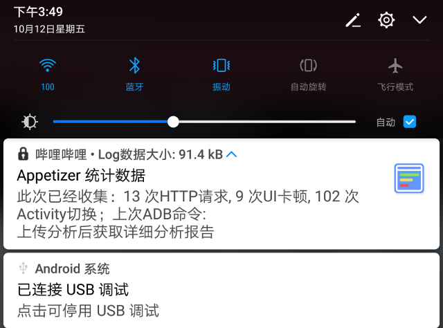
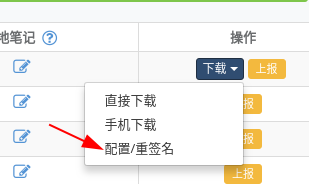
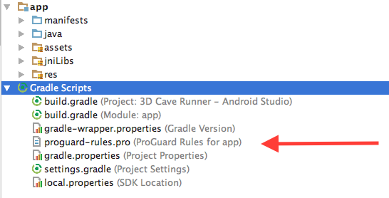
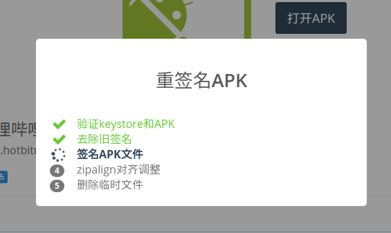

title: 插桩
---

# 插桩

## 什么是插桩
插桩技术可以自动修改APK中的DEX代码，对已有代码打点监控或者增加新的代码；插桩不需要源代码，可以处理混淆后的APK，可以广泛收集异常、ANR、网络请求、主线程卡顿、界面切换等信息，用于调试与测试。

## 插桩
* 图形化界面

* Python客户端：https://github.com/appetizerio/insights.py
```
python -m pip install -r requirements.txt
python insights.py login <username> <password>
python insights.py process <apk> <processed_apk>
```
* Jenkins：使用Python客户端进行插桩
  * 在Jenkins服务器上安装Python客户端并登录：https://github.com/appetizerio/insights.py
  * 在Jenkins `gradle`编译步骤增加如下命令，Windows的用　`Execute Windows batch command`，　Linux和MacOS上用 `Execute Shell`
  * 注意，insights.py请自行替换成之前配置的insights.py工程路径（比如 `/Users/haha/insights.py/insights.py`，注意一个是目录名，里面的才是实际Python脚本文件）
  * 命令的参数中apk是gradle编译的apk文件的路径，和具体Jenkins配置的working directory有关，一般是`build/outputs/apk/app-release.apk`
  * 命令的参数中processed_apk是存放插桩后的apk文件的路径，同样，一般是 `build/outputs/apk/app-release-appetizer.apk`


  * 全部配置完成后尝试构建，输出大致应该是这样的


## 插桩包状态栏提示
* 插桩包运行过程中会有状态栏通知提醒，显示当前已经手机的数据量


## 配置插桩包功能
* 插桩后的APP有诸多可配置的功能，在插桩列表中点击如下进行配置、重签名等，然后保存

* 例如：插桩提供 浮动框 功能，启用后插桩包在启动后有Appetizer浮动功能菜单，在下面开启 “APP内上传分析浮动功能菜单”，点击配置并下载后保存配置好的APK

* 正常安装，启动后如图，即可以在设备上完成上传分析

## 混淆加固与okhttp
插桩需要在dex里搜索相关的函数和函数引用。加固后dex内容不存在，而且加固防止二次代码修改，所以**加固包不可以插桩**；Appetizer设计为可以插桩混淆包，绝大多数功能，包括错误收集、性能数据收集，以及网络请求捕获都可以对混淆有效，唯一的例外是okhttp，请参考以下方案：

绝大多数的http库都不受到混淆的影响，唯一有问题的是okhttp，我们观测到强力的混淆会去除okhttp一些功能，导致Appetizer无法正常截获请求，**解决方案是到`proguard-rules.pro`里面，添加一下规则防止混淆okhttp**，首先找到这个规则文件：



然后添加
```
-keep class okhttp3.** { *; }
-keep interface okhttp3.** { *; }
-dontwarn okhttp3.**
-keep class com.squareup.okhttp.** { *; }
-keep interface com.squareup.okhttp.** { *; }
-dontwarn com.squareup.okhttp.**

-keep class okio.* { *; }
-keep interface okio.* { *; }
-dontwarn okio.**
```
这些字段保证混淆器不会删除okhttp的功能，Appetizer就能正常捕获okhttp的请求了。


## ADB控制
插桩后的 APK 会响应特定的 Broadcast 命令，可以由其他 APP 通过 `sendBroadcast(Intent intent)` 的方式，或者 `adb shell am broadcast -a <ACTION>` 的方式控制插桩包的测试过程，方便集成。以下以 `adb am`为例子：
* `adb shell am broadcast -a io.appetizer.agent.HelloAppetizer`：插桩包会在 Logcat 中输出以 APPETIZER （全大写）为tag的消息 `hello from <pkg>`，其中 `<pkg>` 是插桩包的包名，表示插桩包能够正常响应 broadcast 命令
* `adb shell am broadcast -a io.appetizer.agent.FloatingMenu`：打开或者关闭浮动框功能，不带参数默认为打开，`--ez enabled <true/false>` 指定打开或者关闭
* `adb shell am broadcast -a io.appetizer.agent.TraceBlocking`：打开或者关闭主线程卡顿检测，不带参数默认为打开，`--ez enabled <true/false>` 指定打开或者关闭
* `adb shell am broadcast -a io.appetizer.agent.StartTest`：等同于浮动框的开始测试
* `adb shell am broadcast -a io.appetizer.agent.FinishTest`：等同于浮动框的完成测试
* `adb shell am broadcast -a io.appetizer.agent.UploadForAnalysis`：等同于浮动框的上传分析
* `adb shell am broadcast -a io.appetizer.agent.Log ...`：增加任意自定义Log信息，extras参数会被自动转化成 JSON 记录到 log，例如：`adb shell am broadcast -a io.appetizer.agent.Log --ez myBool true --es haha dada --ei myint 10` 会产生 `{"myBool": true, "haha": "dada", "myint": 10}`的json被记录
* `adb shell am broadcast -a io.appetizer.agent.DumpJacoco`：当收集Jacoco的功能被打开，并且APP已经正常接入了 jacoco 覆盖率库时，该功能将获取当前的 jacoco exec数据，保存到 log，并根据插桩配置中的 `jacoco.resetOnDump` 决定是否清空 exec 数据

**注意： broadcast 命令要求插桩包进程正常运行于后台，即APP可以处于前台Activity状态，或者后台Service状态，但APP的进程一定要存在，如果进程不存在，插桩APP不会自动被 broadcast 拉起，命令将无效**

### 多个运行插桩包同时运行的情况
当设备上有多个插桩包同时运行时，每个插桩包都会响应同名的 broadcast 命令，如果需要精确只控制某个APP，可以将 `adb shell am broadcast -a io.appetizer.agent.HelloAppetizer` 改成 `adb shell am broadcast -a io.appetizer.agent.HelloAppetizer <pkg>`，这样 broadcast 只会通知指定的 pkg。注意，当 broadcast 有附加参数时 `<pkg>` 需要在命令最后，例如：`adb shell am broadcast -a io.appetizer.agent.Log --ez myBool true --es haha dada --ei myint 10 com.example.myapp`

## APP权限要求
* 一般情况下，插桩不需要为APP增加权限，以下两种特殊情况下需要权限
  * 使用 `浮动框上传分析` 时，要求APP有网络访问权限 `android.permission.INTERNET`
  * 当 APP运行在 `Android <=4.4(Kitkat)` 上时，PC端上传分析要求APP有外存读写权限 `android.permission.WRITE_EXTERNAL_STORAGE`
* 也就是说如果APP运行在`Android <=4.4(Kitkat)`，如果即没有网络访问也没有外存访问权限，则收集到的数据无法上传分析

## 常见插桩问题排查
* 插桩失败 -> 查看列表中插桩任务的状态
  * 等待上传、服务器问题、未知问题 -> 请上报
  * APP加固 -> 请插桩 debug 或者 release包，不能加固，详见 [混淆与加固](#混淆加固与okhttp)
  * APP已经插桩 -> 请插桩一个未插桩的APK，已插桩即可使用
* 插桩后启动闪退
  * 确认是否有签名检查机制，使用主导航 APK文件工具，打开插桩包，对插桩包进行重新签名，使用调试Key重新签名，如下图，重新签名后再试


  * 请查看 [插桩原理](../advanced/under-the-hood-instrumentation.html)是否有相关情况，问题未解决 -> 请上报
* 插桩后无法抓取HTTP请求
  * 详见 [混淆与加固](#混淆加固与okhttp)
* 插桩后的APK收集的数据存储位置
  * `/sdcard/Android/data/<包名>/files/io.appetizer/<包名>.log`
