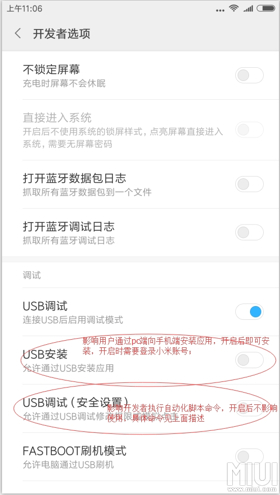

title: 录制重放
---

# 录制重放 TODO

## 小米设备开启权限
http://www.miui.com/thread-5711795-1-1.html

## 同纵宽比问题

## 适用面

## WiFi
https://stackoverflow.com/questions/2604727/how-can-i-connect-to-android-with-adb-over-tcp

## 问题上报
* 优秀
https://github.com/appetizerio/replaykit/issues/3
https://github.com/appetizerio/replaykit/issues/5
https://github.com/appetizerio/replaykit/issues/8

`getevent -lt`

`getevent -lp`

与STF以及基于minitouch的框架不能同时运行