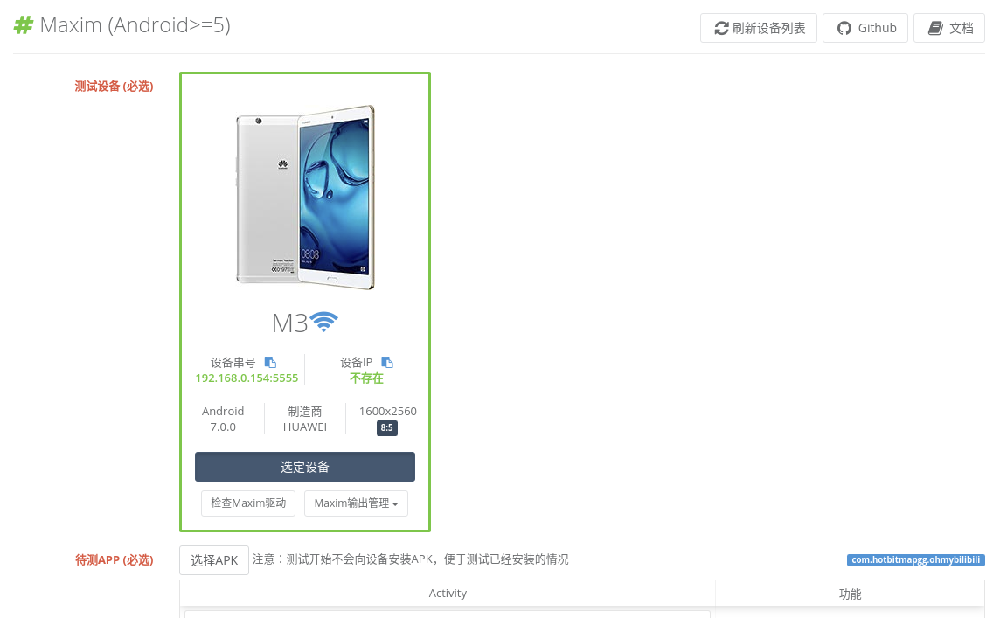
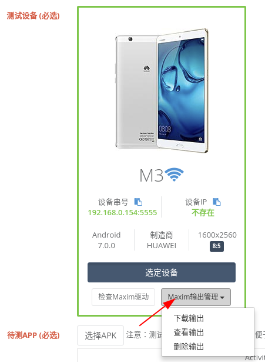

title: 测试
---

# 测试
Appetizer支持多种测试方法：设备端手工测试，PC端手工测试，脚本测试，自动化工具测试

## 设备端手工测试
* 在设备端安装并启动插桩后的APP自动有Appetizer浮动功能菜单，开始测试 放弃测试 上传分析

* 设备端手工测试适合少量数据采集的情况，如果上传失败，请尝试使用 PC端手工测试 或者 命令行上传分析：https://github.com/appetizerio/insights.py

## PC端手工测试
* 通过USB连接测试Android设备，在设备上启动开发者选项->USB调试，在主导航选择 `APP测试`，显示检测到已连接的设备；选择设备，选择已插桩的APK作为待测APP，如下图所示

* 点击 `安装APP` 后，点击 `启动APP并开始测试`

* 在设备上对APP进行操作，然后点击 `上传分析` 等待分析完成

* 完成测试用于放弃这次测试的数据；每次开始测试会清空之前的数据

* 优点：直接、简单、完美理解业务流程、完美模拟真实用户行为，适用于新业务（自动化未跟上），表单类业务（输入要求或者业务逻辑复杂），有特殊交互（例如特殊手势），有防止自动化的情况（例如校验码）
* 缺点：效率低下，不能批量多设备运行
* 建议：可配合录制重放减轻部分工作

## 脚本测试
* 在主导航选择 `测试脚本`，使用Python向一个设备安装uiautomator2组件：https://github.com/openatx/uiautomator2/#installation
* 在Appetizer中点击 写脚本 ，进入所见即所得脚本编辑模式

* 脚本编辑器左边为会实时设备投屏，右边上方为可以插入的代码，下方为正在编辑的脚本；脚本语言为Python，支持 [uiautomator2](https://github.com/openatx/uiautomator2) 框架以及 Appium框架，请观看以下视频教学一个完整的脚本编写的过程
：
<video src="/videos/20190215inspector.mp4" loop controls muted width="50%" class="center-block"/>

## 自动化测试：UI压力测试Maxim
[Maxim](https://github.com/zhangzhao4444/Maxim) 是一个UI自动化测试工具，可以全自动解析界面控件树，并按照一定遍历规则进行点击、滑动、输入等操作；可通过Appetizer 主导航->自动化测试 来使用；
* 首次使用，首先下载最新版本的framework.jar和monkey.jar并上传到设备的`/sdcard`目录：https://github.com/zhangzhao4444/Maxim#%E7%8E%AF%E5%A2%83%E9%A2%84%E5%A4%87
* 在Appetizer界面中选择设备、待测APK文件（确保测试开始前APP已经安装到设备），其他选项为可选参数

* 点击下方开始测试，设备端就是自动化开始操作见面了

* 优点：稳定可靠(Android 5-9)，速度快，全自动，可配置
* 缺点：对复杂业务（需要特殊输入的不合适），APP需要配置跳过难以自动化的部分，例如登录、表单等
* 为了更有效地使用Maxim，需要对APP进行一系列的配置
  * Activity级别黑白名单，可以配置Maxim只遍历部分的Activity，或者禁止进入某些Activity（实际运行中一旦进入会自动按返回键退出）；配置方法为首先选择待测APK，在出现的黑白名单里面设置允许禁止遍历一些Acitivty；点击Activity表头可以对Activity进行排序，Activity表头下面的输入框可以筛选Activity；常见需要禁止遍历的Activity包括各类第三方登录的Activity、第三方分享的Activity以及一些人工客服页面、帮助页面等等；注意，黑白名单只对Activity有效，如果APP使用了Fragment这类子页面设计并不能遍历对其的控制

  * 精细化配置：Maxim还提供了一些精细化的控制，比如max.xpath.actions，可以对于某些界面进行确定性的步骤（好比脚本），常用的可以自动登录；max.widget.black可以屏蔽某些界面上的某些控件/区域，常用于屏蔽一些不想进入的子界面以及广告区域等；max.config可以配置是否需要在测试过程中自动截图，并且设置启动等待时间等；详细的参数意义以及格式见：https://testerhome.com/topics/11719

  * 其他配置包括：事件间延迟（控制Maxim两次产生的自动化操作间的时间，一般建议在1500ms左右，太快没有意义）；日志级别（控制Maxim输出的log，可以看到每次操作位置、黑白名单作用，拉活，APP crash等信息）；输出路径（Appetizer提供的收集额外的测试数据存储的电脑端位置）；数据收集（Appetizer提供的额外的数据手机功能）

  * 此外，在选择设备的地方，有方便管理Maxim设备端采集的数据（截图，XML等）的功能，可以在一次测试结束后一键下载到PC端

  * Maxim文档：https://testerhome.com/topics/11719
  * Maxim QQ群：608824162

## 自动化测试：UI遍历测试 AppCrawler
[AppCrawler](https://testerhome.com/topics/8343)是一个基于Appium的自动化遍历工具，可以全自动解析界面控件树，通过配置进行遍历以及比较复杂的交互方案，适用Android/iOS；可通过Appetizer 主导航->自动化测试->UI自动遍历来使用

* 优点：可用于Android/iOS，设计合理的遍历规则的情况下可以达到比较好的自动化效果
* 缺点：继承了Appium的所有Bug，偶尔不稳定，交互速度慢等；

Appetizer简化了配置 AppCrawler 的工作； Appetizer 提供了以下便利：
* 所见即所得YML配置文件编辑器，不用跑就知道配置格式对不对
* 图形化支持所有 AppCrawler 参数
* 配置文件自动产生，自动更新，保证每次都是最新版本，不用特别指定路径

```
----------------
AppCrawler 2.0.0
app爬虫, 用于自动遍历测试. 支持Android和iOS, 支持真机和模拟器
帮助文档: http://seveniruby.gitbooks.io/appcrawler
移动测试技术交流: https://testerhome.com
感谢: 晓光 泉龙 杨榕 恒温 mikezhou yaming116
感谢提供商业支持的优秀公司: Keep
--------------------------------


Usage: appcrawler [options]

  -a, --app <value>        Android或者iOS的文件地址, 可以是网络地址, 赋值给appium的app选项
  -c, --conf <value>       配置文件地址
  -p, --platform <value>   平台类型android或者ios, 默认会根据app后缀名自动判断
  -t, --maxTime <value>    最大运行时间. 单位为秒. 超过此值会退出. 默认最长运行3个小时
  -u, --appium <value>     appium的url地址
  -o, --output <value>     遍历结果的保存目录. 里面会存放遍历生成的截图, 思维导图和日志
  --capability k1=v1,k2=v2...
                           appium capability选项, 这个参数会覆盖-c指定的配置模板参数, 用于在模板配置之上的参数微调
  -r, --report <value>     输出html和xml报告
  --template <value>       输出代码模板
  --master <value>         master的diff.yml文件地址
  --candidate <value>      candidate环境的diff.yml文件
  --diff                   执行diff对比
  -vv, --verbose           是否展示更多debug信息
  --help
示例
appcrawler -a xueqiu.apk
appcrawler -a xueqiu.apk --capability noReset=true
appcrawler -c conf/xueqiu.json -p android -o result/
appcrawler -c xueqiu.json --capability udid=[你的udid] -a Snowball.app
appcrawler -c xueqiu.json -a Snowball.app -u 4730
appcrawler -c xueqiu.json -a Snowball.app -u http://127.0.0.1:4730/wd/hub

#启动已经安装过的app
appcrawler --capability appPackage=com.xueqiu.android,appActivity=.welcomeActivity

#从已经结束的结果中重新生成报告
appcrawler --report result/

#新老版本对比
appcrawler --candidate result/ --master pre/ --report ./

#自动生成Page Object代码模板文件
appcrawler --template PageObjectDemo.ssp --output result/

#根据wda的inspector生成测试用例代码
appcrawler --template PageObjectDemo.ssp -u http://localhost:8100
```
