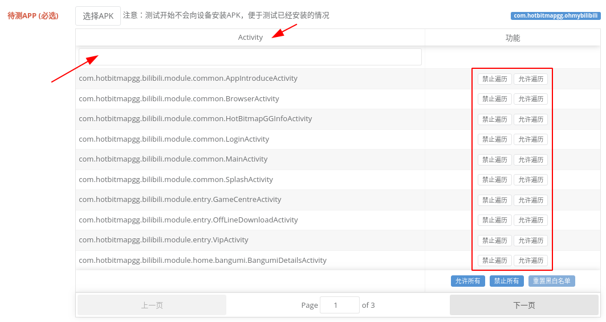

title: 测试
---

# 测试

> 测试方法千千万，不要迷信任何一种；当工作只需要一次点击一个工具时，请准备下岗

## 手工测试 PC端控制
[参考快速入门教程](../get-started.html#运行测试并提交分析)
* 优点：直接、简单、完美理解业务流程、完美模拟真实用户行为，适用于新业务（自动化未跟上），表单类业务（输入要求或者业务逻辑复杂），有特殊交互（例如特殊手势），有防止自动化的情况（例如校验码）
* 缺点：效率低下，不能批量多设备运行
* 建议：可配合录制重放减轻部分工作

## 手工测试 浮动框
[在插桩时开启Appetizer浮动框](instrumentation.html#浮动框功能)，可以完全在设备端进行测试到上传分析


## UI自动化脚本测试
* 社区有很多教学，搜索引擎和社区是学习的好地方；搜索关键字：Appium, uiautomator, Calabash, xpath
  * [python appium UI 自动化测试框架讨论](https://testerhome.com/topics/11866)
  * [浅谈自动化测试工具 python-uiautomator2](https://testerhome.com/topics/11357)
  * [UI 自动化框架调研总结](https://testerhome.com/topics/6602)
  * [网易 UI 自动化工具 Airtest 浅用记录](https://testerhome.com/topics/12391)
* 优点：高效，能够自动完成重复劳动，相对可以跨多个设备运行同一套任务；适合比较固定的业务
* 缺点：并不是所有操作都可以自动化，例如有安全保护防止自动化的界面，有特殊舒适，另外业务变化快的情况下自动化脚本维护成本会剧烈上升
* 建议：配合手工测试
* Appetizer提供了Python命令行工具，用于配合自动化脚本运行插桩包进行分析出报告
  * [插桩分析 命令行(Python) ](../integration/insights.py.html)
  * [Appetizer 整合梳理](https://testerhome.com/topics/10290)

## UI压力测试Maxim
[Maxim](https://github.com/zhangzhao4444/Maxim) 是一个基于uiautomator的快速UI界面压力测试工具，可以全自动解析界面控件树，并按照一定遍历规则进行点击、滑动、输入等操作；可通过Appetizer 主导航->APP测试->UI压力测试来使用

* 优点：稳定可靠(Android 5-7)，速度快，全自动，可配置
* 缺点：对复杂业务（需要特殊输入的不合适），APP需要配置跳过难以自动化的部分，例如登录、表单等


|  一应俱全的Maxim配置  | 黑白名单 | 问题上报作者，下载结果 | 
|:-----------------:| :---------------: | :--: |
|   || |

## UI遍历测试AppCrawler
[AppCrawler](https://testerhome.com/topics/8343)是一个基于Appium的自动化遍历工具，可以全自动解析界面控件树，通过配置进行遍历以及比较复杂的交互方案，适用Android/iOS；可通过Appetizer 主导航->APP测试->UI自动遍历来使用

* 优点：可用于Android/iOS，设计合理的遍历规则的情况下可以达到比较好的自动化效果
* 缺点：继承了Appium的所有Bug，偶尔不稳定，交互速度慢等；
```
----------------
AppCrawler 2.0.0
app爬虫, 用于自动遍历测试. 支持Android和iOS, 支持真机和模拟器
帮助文档: http://seveniruby.gitbooks.io/appcrawler
移动测试技术交流: https://testerhome.com
感谢: 晓光 泉龙 杨榕 恒温 mikezhou yaming116
感谢提供商业支持的优秀公司: Keep
--------------------------------


Usage: appcrawler [options]

  -a, --app <value>        Android或者iOS的文件地址, 可以是网络地址, 赋值给appium的app选项
  -c, --conf <value>       配置文件地址
  -p, --platform <value>   平台类型android或者ios, 默认会根据app后缀名自动判断
  -t, --maxTime <value>    最大运行时间. 单位为秒. 超过此值会退出. 默认最长运行3个小时
  -u, --appium <value>     appium的url地址
  -o, --output <value>     遍历结果的保存目录. 里面会存放遍历生成的截图, 思维导图和日志
  --capability k1=v1,k2=v2...
                           appium capability选项, 这个参数会覆盖-c指定的配置模板参数, 用于在模板配置之上的参数微调
  -r, --report <value>     输出html和xml报告
  --template <value>       输出代码模板
  --master <value>         master的diff.yml文件地址
  --candidate <value>      candidate环境的diff.yml文件
  --diff                   执行diff对比
  -vv, --verbose           是否展示更多debug信息
  --help
示例
appcrawler -a xueqiu.apk
appcrawler -a xueqiu.apk --capability noReset=true
appcrawler -c conf/xueqiu.json -p android -o result/
appcrawler -c xueqiu.json --capability udid=[你的udid] -a Snowball.app
appcrawler -c xueqiu.json -a Snowball.app -u 4730
appcrawler -c xueqiu.json -a Snowball.app -u http://127.0.0.1:4730/wd/hub

#启动已经安装过的app
appcrawler --capability appPackage=com.xueqiu.android,appActivity=.welcomeActivity

#从已经结束的结果中重新生成报告
appcrawler --report result/

#新老版本对比
appcrawler --candidate result/ --master pre/ --report ./

#自动生成Page Object代码模板文件
appcrawler --template PageObjectDemo.ssp --output result/

#根据wda的inspector生成测试用例代码
appcrawler --template PageObjectDemo.ssp -u http://localhost:8100
```
